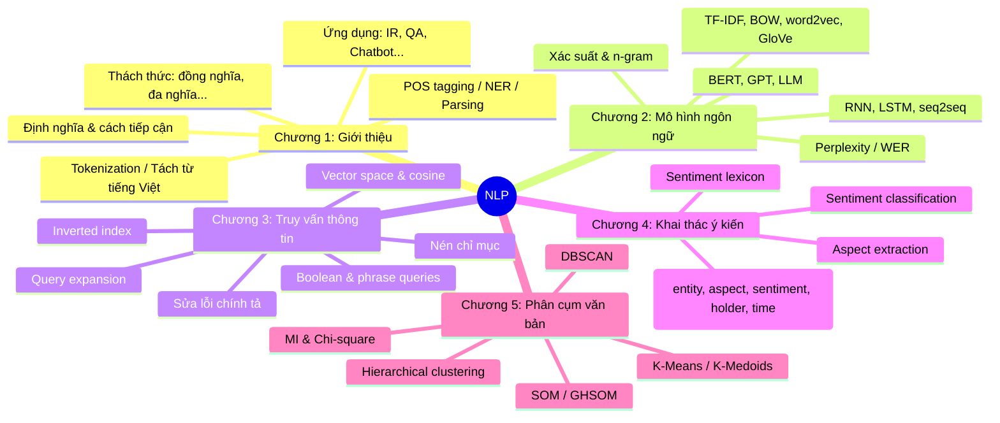

# Mục lục Tóm tắt Lý thuyết NLP

> Tổng hợp nội dung lý thuyết từ 5 chapter của môn Xử lý Ngôn ngữ Tự nhiên (NLP) — Giảng viên: Trương Quốc Định.

| Chương | Chủ đề | File tóm tắt | Nguồn slide |
|---|---|---|---|
| 1 | Giới thiệu NLP (Introduction to NLP) | [tom-tat-chuong-1-gioi-thieu-nlp.md](tom-tat-chuong-1-gioi-thieu-nlp.md) | Chapter1-Introduction_to_NLP.pptx (63 slides) |
| 2 | Mô hình Ngôn ngữ (Language Models) | [tom-tat-chuong-2-mo-hinh-ngon-ngu.md](tom-tat-chuong-2-mo-hinh-ngon-ngu.md) | Chapter2-LanguageModels.pptx (84 slides) |
| 3 | Truy vấn Thông tin (Information Retrieval) | [tom-tat-chuong-3-truy-van-thong-tin.md](tom-tat-chuong-3-truy-van-thong-tin.md) | Chapter3-InformationRetrieval.pptx (49 slides) |
| 4 | Khai thác Ý kiến (Opinion Mining) | [tom-tat-chuong-4-khai-thac-y-kien.md](tom-tat-chuong-4-khai-thac-y-kien.md) | Chapter4-OpinionMining.pptx (32 slides) |
| 5 | Phân cụm Văn bản (Text Clustering) | [tom-tat-chuong-5-phan-cum-van-ban.md](tom-tat-chuong-5-phan-cum-van-ban.md) | Chapter5-Clustering.pptx (40 slides) |

---

## Bản đồ kiến thức các chương

## Liên hệ với đề tài RAG (smart-rag-qa)

| Thành phần RAG | Kiến thức nền từ |
|---|---|
| **Preprocessing / Chunking** | Chương 1 (tokenization, tách từ tiếng Việt) |
| **Embedding** | Chương 2 (TF-IDF, word2vec, GloVe, BERT) |
| **Retriever** | Chương 3 (inverted index, vector space, cosine) |
| **Baseline TF-IDF + Cosine** | Chương 2 + 3 |
| **Generation (LLM)** | Chương 2 (GPT, LLM, prompting) |
| **Đánh giá retrieval** | Chương 3 (relevance, ranking) |
| **Đánh giá thống kê** | Chương 5 (chi-square, MI) |
| **Phân tích corpus** | Chương 4 + 5 (topic modelling, clustering) |

---

## Ghi chú

- Nội dung tóm tắt **bám sát nguyên văn slide** (trích xuất bằng `scripts/extract_pptx_text.py`); các slide chỉ có hình ảnh/công thức không trích xuất được text sẽ thiếu chi tiết — cần đối chiếu slide gốc khi trình bày.
- Văn bản trích xuất thô lưu tại `scripts/extracted/*.txt` để tra cứu.
- Các thuật ngữ kỹ thuật giữ tiếng Anh kèm giải thích tiếng Việt theo quy ước trong `AGENTS.md`.
